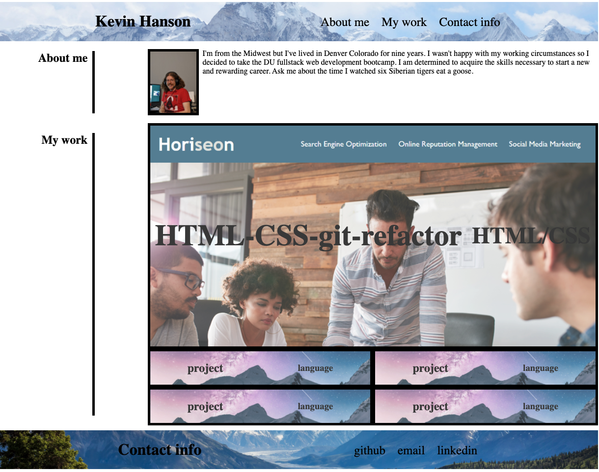

# Projects-Portfolio

## Portfolio

The purpose of my portfolio is to showcase my completed development projects for future employers. I included a small amount of information about myself. The My work section includes links that will go to completed projects from the bootcamp. The footer has links to contact me in various ways.

## Technologies used

- HTML
- CSS

### Deployed application

https://ziffoit.github.io/Projects-Portfolio/

### Screenshot

